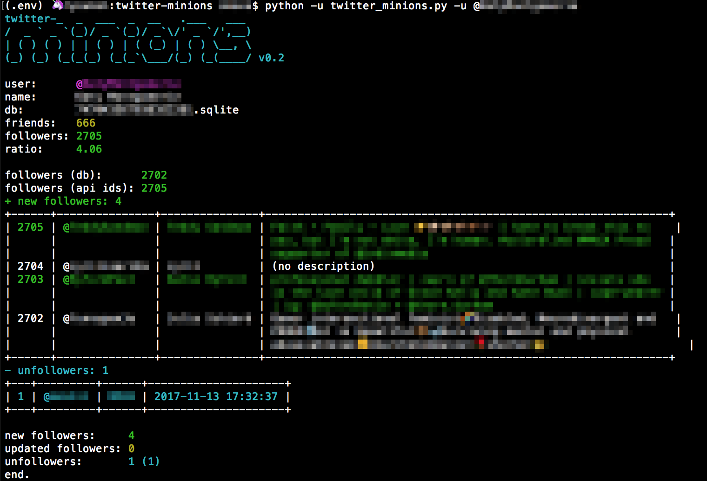

# twitter-minions
Maintains simple ad hoc database of a twitter users followers and unfollowers. Data is collected using the python [tweepy](http://www.tweepy.org/) wrapper for the [twitter api](https://developer.twitter.com/en/docs/api-reference-index) and stored in a sqlite3 database.

This is a hobby project created to figure out who has un/followed me when I notice changes in my twitter follower count. Additional data such as follower json is stored as it may be useful for some analytics at some stage.

Unfollowers and followers are determined by comparing current followers to the database records. People who both follow and then unfollow in-between instances of running the script will not be captured in the database.

### Requirements

```python (3.6)``` ```sqlite3 (2.6)```
```tweepy (3.5.0)``` ```prettytable (0.7.2)```
```colorama (0.3.5)```

### Usage

```
usage: twitter_minions.py [-h] -u USER [-upd]

maintains a database of a twitter users followers and unfollowers.

optional arguments:
  -h, --help            show this help message and exit
  -u USER, --user USER  twitter user @name or numeric id
  -upd, --update        make a tweepy_api.followers request that updates user
                        data for all database follower records
```

| 
|:--| 
| standard usage displaying new followers added to the database and any new unfollows. |

### Processing

If new followers are found the script inserts their data into the ```followers``` table. If unfollowers are found their follower records are copied into the ```unfollowers``` table and removed from the ```followers``` table.

If the ```--update``` option is used then user objects will be retrieved for all users in the ```followers``` table of the database and all fields except ```user_id``` and ```user_time_found``` updated per record. This means the database will have an updated data record for a follower as of the last time the script was run.

The first time the script is run for a user it will need to do a full update to populate the database. This can be very slow and may require many lengthy pauses whilst the twitter api rate limits reset, depending on the number of user followers.

After the first run the default is follower id only processing. This identifies changes in followers but only requests user objects and inserts data for any new followers found rather than updating all records.

### Database

A database is created per user in the scripts local directory and named after their twitter user id so that it is unique.

The database has two tables ```followers``` and ```unfollowers``` that store follower records. Records data is derived from the twitter api user objects returned from either ```tweepy.followers``` or ```tweepy.get_user``` api requests. Records also have timestamps to track when a follower was added, updated or unfollowed.

#### ```followers``` table

| field | description
| :----- | :----- |
| user_id | unique twitter id of the follower
| user_name | twitter users full name in profile
| user_screen_name | twitter users screen name, their @name
| user_time_found | time that the follower record was entered into the table
| user_time_updated | time that the follower record data was last updated
| user_json | raw json about the follower from the api user json attribute

#### ```unfollowers``` table

| field | description
| :----- | :----- |
| id | unique unfollow record id
| user_id | twitter id of the follower
| user_name | twitter users full name in profile
| user_screen_name | twitter users screen name, their @name
| user_time_found | time that the follower record was entered into the table
| user_time_lost | time that the follower became an unfollower

```ruby
end.
```
